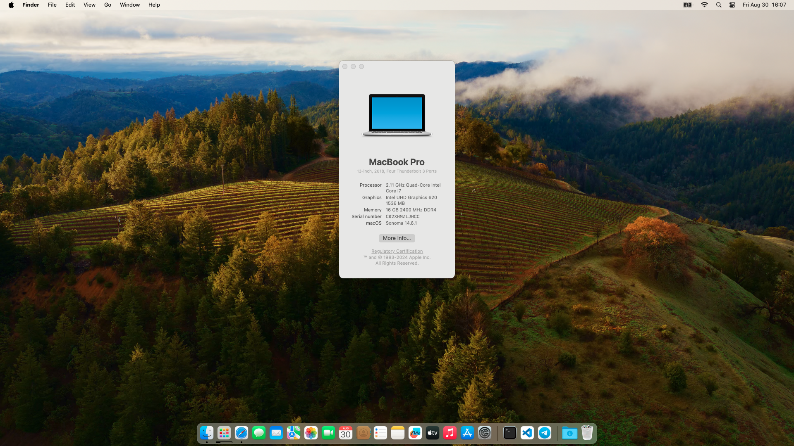

 # Dell Latitude 7490 macOS Sonoma

## 🔍 Overview
This repository compiles all the necessary resources to get macOS Sonoma up and running on your Dell Latitude 7490. While this repository is primarily a compilation of existing resources and tools, it includes all the essential components to ensure smooth installation and performance on your Latitude 7490.

## ℹ️ Current Status

| Feature | Status | Notes |
| ------------- | ------------- | ------------- |
| **Intel iGPU** | ✅ Working | Fully supported, smooth graphics performance |
| **Trackpad** | ✅ Working | Full gesture support, offers a great experience |
| **Wi-Fi** | ✅ Working | Native support with the compatible Intel card |
| **Bluetooth** | ✅ Working | Native support, Airdrop and Handoff function as expected with compatible Intel card |
| **USB-C (Charging & Display Output)** | ✅ Working | USB-C charging and display output work as intended |
| **Speakers and Headphones** | ✅ Working | Crystal clear audio, no issues detected |
| **Built-in Microphone** | ✅ Working | Fully functional |
| **Webcam** | ✅ Working | Works with all macOS native apps |
| **SD Card Reader** | ✅ Working | Fully supported |
| **Ethernet** | ✅ Working | Built-in Ethernet port is functional |
| **Handoff** | ✅ Working | Seamless continuity features with Apple devices |
| **NVMe SSD** | ✅ Working | Supported with the correct NVMeFix kext

### ℹ️ Changing Serial Number, Board Serial Number, and SmUUID

To use iMessage and other Apple services, you need to generate your own serial numbers. This can be done using [Hackintool](https://github.com/benbaker76/Hackintool). Go to the “Serial“ tab and make sure model is set to MacBookPro15,1. Use the barcode-with-apple button to check your generated serial numbers. If the website tells you that the serial number isn't valid, everything is fine. Otherwise, you have to generate a new set.

Next you will have to copy the following values from Hackintool to your config.plist:
- Serial Number -> Root/PlatformInfo/Generic/SystemSerialNumber
- Board Number -> Root/PlatformInfo/Generic/MLB
- SmUUID -> Root/PlatformInfo/Generic/SystemUUID

Reboot and Apple services should work.

If they don't, follow [this in-depth guide](https://dortania.github.io/OpenCore-Post-Install/universal/iservices.html). It goes deeper into ROM, clearing NVRAM, clearing Keychain (missing this step might cause major issues), and much more.

